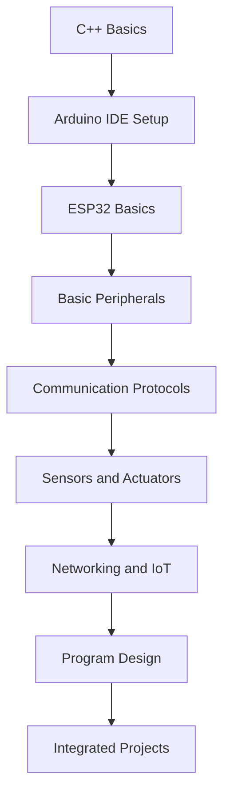

# ESP32

This directory contains the ESP32 teaching track for the "Shan Hai Ling Shou Ji" project and the wider hardware training camp.

The course starts with programming basics, setup, GPIO, sensors, and communication protocols. It then expands into networking, program design, and integrated projects. `Shan Hai Ling Shou Ji` is one application scenario, not the boundary of the course.

The default path uses `Arduino IDE 2.x + Arduino Framework` so beginners can get feedback quickly. Learners can move to `PlatformIO` and `ESP-IDF` later when the project becomes more complex.

## 1. Course Scope

### 1.1. Main Topics

- ESP32 environment setup
- C/C++ basics for Arduino
- GPIO input and output
- ADC and PWM
- UART, I2C, and SPI
- Common sensors and actuators
- Wi-Fi and Bluetooth
- Web services and remote control
- Data collection and upload
- `millis()`-based non-blocking logic
- State machines and modular design
- Integrated system development

### 1.2. Target Learners

1. Beginners using ESP32 for the first time
2. Students preparing for IoT and smart hardware projects
3. Learners moving from Arduino into engineering-style development
4. Teachers or mentors running a training camp
5. Teams organizing material for GitHub-based teaching

### 1.3. Teaching Principles

1. Start from concepts, not from assumed embedded experience.
2. Give every concept a runnable example.
3. Practice single-module tests before multi-module integration.
4. Understand hardware and program flow before full projects.
5. Emphasize debugging, observation, and system design.
6. Make the content useful both as a course and as a training camp plan.

## 2. Learning Goals

After completing the track, learners should be able to:

1. Recognize the main parts of an ESP32 board.
2. Set up Arduino IDE and the ESP32 support package.
3. Write, compile, and upload ESP32 code.
4. Use the serial monitor for output and debugging.
5. Control input and output devices with GPIO.
6. Read analog and digital sensor values.
7. Use PWM to control lights, motors, and other actuators.
8. Connect modules with UART, I2C, and SPI.
9. Use Wi-Fi and Bluetooth for device communication.
10. Build a simple web control page or network service.
11. Organize code in a non-blocking style.
12. Manage projects with functions, structures, classes, and state machines.
13. Integrate sensors, actuators, and communication modules into a complete system.
14. Finish a basic IoT or smart hardware project independently.

## 3. Directory Guide

### 3.1. Stage 1

1. [Getting Started](./01-getting-started/README.md)
2. [C++ Basics for ESP32](./01-getting-started/cpp-basics.md)
3. [Arduino IDE Setup](./01-getting-started/arduino-ide.md)
4. [ESP32 Basics](./01-getting-started/esp32-basics.md)

### 3.2. Stage 2

1. [Basic Peripherals](./02-basic-peripherals/README.md)
2. [GPIO](./02-basic-peripherals/gpio.md)
3. [ADC and PWM](./02-basic-peripherals/adc-and-pwm.md)
4. [Serial Monitor](./02-basic-peripherals/serial-monitor.md)

### 3.3. Stage 3

1. [Communication Protocols](./03-communication-protocols/README.md)
2. [UART](./03-communication-protocols/uart.md)
3. [I2C](./03-communication-protocols/i2c.md)
4. [SPI](./03-communication-protocols/spi.md)

### 3.4. Stage 4

1. [Sensors and Actuators](./04-sensors-and-actuators/README.md)
2. [Sensors](./04-sensors-and-actuators/sensors.md)
3. [Actuators](./04-sensors-and-actuators/actuators.md)
4. [Common Modules](./04-sensors-and-actuators/common-modules.md)

### 3.5. Stage 5

1. [Networking and IoT](./05-networking-and-iot/README.md)
2. [Wi-Fi](./05-networking-and-iot/wifi.md)
3. [Bluetooth](./05-networking-and-iot/bluetooth.md)
4. [Web Server](./05-networking-and-iot/web-server.md)
5. [MQTT](./05-networking-and-iot/mqtt.md)

### 3.6. Stage 6

1. [Program Design](./06-program-design/README.md)
2. [Millis Timing](./06-program-design/millis-timing.md)
3. [State Machine](./06-program-design/state-machine.md)
4. [Project Structure](./06-program-design/project-structure.md)
5. [Debugging](./06-program-design/debugging.md)

### 3.7. Stage 7

1. [Projects](./07-projects/README.md)
2. [Project Requirements](./07-projects/project-requirements.md)
3. [Project Checklist](./07-projects/project-checklist.md)

## 4. Recommended Learning Order

The best path is to finish Stage 1 first, then move into peripherals, communication, networking, and projects.
