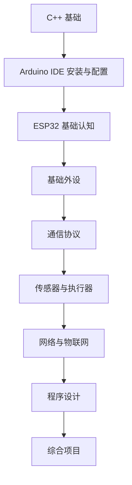

# ESP32

这个目录整理《山海灵兽纪》项目中的 ESP32 教学内容，也是一套可以独立使用的 ESP32 训练营课程。

课程从基础编程、开发环境、GPIO、传感器和通信协议开始，逐步扩展到网络连接、程序设计和综合项目开发。`山海灵兽纪` 只是其中一个综合应用案例，不是课程边界。

默认教学路线使用 `Arduino IDE 2.x + Arduino-ESP32 Core 3.x + Arduino Framework`，先帮助初学者快速获得反馈，再根据项目复杂度逐步过渡到 `PlatformIO` 和 `ESP-IDF`。

## 1. 课程定位

### 1.1. 学习范围

本课程主要覆盖以下内容：

- ESP32 开发环境配置
- C/C++ 基础
- GPIO 输入与输出
- ADC 和 PWM
- UART、I2C、SPI
- 常见传感器与执行器
- Wi-Fi 和蓝牙通信
- Web 服务与网络控制
- 数据采集与上传
- `millis()` 非阻塞编程
- 状态机与模块化设计
- 综合系统开发

### 1.2. 适用人群

本课程适合：

1. 第一次接触 ESP32 的初学者
2. 准备学习物联网和智能硬件的学生
3. 想从 Arduino 过渡到工程化开发的学习者
4. 需要带学弟学妹做训练营的老师或助教
5. 计划把课程成果落到 GitHub 仓库中的团队

### 1.3. 课程原则

1. 从基础概念开始，不默认学习者已有嵌入式经验。
2. 每个知识点都配一个可运行的小例子。
3. 先做单模块实验，再做多模块联动。
4. 先理解硬件和程序逻辑，再进入综合项目。
5. 强调调试、观察和系统设计，而不是只会复制代码。
6. 课程内容可独立学习，也能直接嵌入训练营安排。

## 2. 学习目标

完成这套课程后，学习者应该能够：

1. 认识 ESP32 开发板的基本组成。
2. 配置 Arduino IDE 和 ESP32 开发环境。
3. 编写、编译并上传 ESP32 程序。
4. 使用串口监视器查看程序输出和调试信息。
5. 使用 GPIO 控制输入和输出设备。
6. 读取模拟量和数字量传感器。
7. 使用 PWM 控制灯光、电机和其他执行器。
8. 使用 UART、I2C 和 SPI 连接外部模块。
9. 使用 Wi-Fi 和蓝牙完成设备通信。
10. 搭建简单的 Web 控制页面或网络服务。
11. 使用非阻塞方式组织程序。
12. 使用函数、结构体、类和状态机管理项目。
13. 把多个传感器、执行器和通信模块整合成完整系统。
14. 独立完成一个基础物联网或智能硬件项目。

## 3. 目录导航

### 3.1. 第一阶段

1. [入门准备](./01-getting-started/README.md)
2. [ESP32 的 C++ 基础](./01-getting-started/cpp-basics.md)
3. [Arduino IDE 安装与配置](./01-getting-started/arduino-ide.md)
4. [ESP32 基础认知](./01-getting-started/esp32-basics.md)

### 3.2. 第二阶段

1. [基础外设](./02-basic-peripherals/README.md)
2. [GPIO](./02-basic-peripherals/gpio.md)
3. [ADC 与 PWM](./02-basic-peripherals/adc-and-pwm.md)
4. [串口监视器](./02-basic-peripherals/serial-monitor.md)

### 3.3. 第三阶段

1. [通信协议](./03-communication-protocols/README.md)
2. [UART](./03-communication-protocols/uart.md)
3. [I2C](./03-communication-protocols/i2c.md)
4. [SPI](./03-communication-protocols/spi.md)

### 3.4. 第四阶段

1. [传感器与执行器](./04-sensors-and-actuators/README.md)
2. [传感器](./04-sensors-and-actuators/sensors.md)
3. [执行器](./04-sensors-and-actuators/actuators.md)
4. [常见模块](./04-sensors-and-actuators/common-modules.md)

### 3.5. 第五阶段

1. [网络与物联网](./05-networking-and-iot/README.md)
2. [Wi-Fi](./05-networking-and-iot/wifi.md)
3. [蓝牙](./05-networking-and-iot/bluetooth.md)
4. [Web 服务器](./05-networking-and-iot/web-server.md)
5. [MQTT](./05-networking-and-iot/mqtt.md)

### 3.6. 第六阶段

1. [程序设计](./06-program-design/README.md)
2. [Millis 计时](./06-program-design/millis-timing.md)
3. [状态机](./06-program-design/state-machine.md)
4. [项目结构](./06-program-design/project-structure.md)
5. [调试方法](./06-program-design/debugging.md)

### 3.7. 第七阶段

1. [综合项目](./07-projects/README.md)
2. [项目需求](./07-projects/project-requirements.md)
3. [项目检查清单](./07-projects/project-checklist.md)

## 4. 推荐学习顺序

建议先完成第一阶段，再进入外设、通信和物联网部分。这样更容易建立完整的知识框架，也更方便把内容整理进 GitHub 的训练营仓库。
